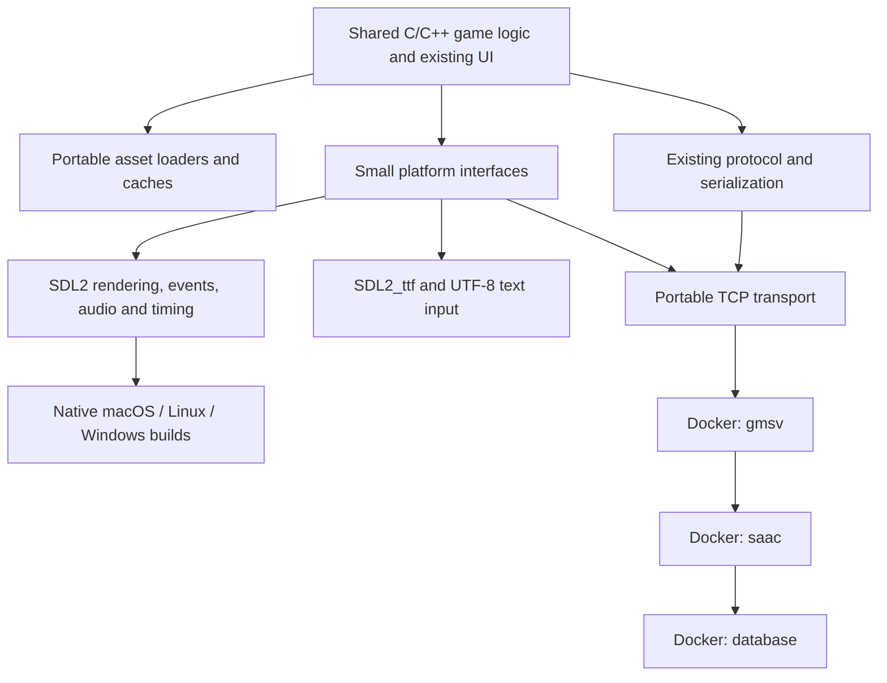

# Stone Age: native cross-platform client and Docker server

Date: 2026-09-29. Status: proposal; the native client and Compose stack are not implemented yet.

## Decision

Build one portable C/C++ client using **SDL2**, with native builds for **macOS ARM64, Linux x86-64, and Windows x86-64**. Run the existing account and game servers in Linux containers, initially preserving their 32-bit x86 environment. macOS is the first playable target; Linux and Windows should compile from the first client milestone.

Yes: SDL2 supports all three operating systems. Each platform gets its own executable and dependencies; SDL2 supplies the platform integration. This produces a native Mac game without CrossOver. SDL2 does not itself make the game's file formats, networking, text handling, or assembly portable. [SDL2 platform overview](https://wiki.libsdl.org/SDL2/Introduction), [macOS support](https://wiki.libsdl.org/SDL2/README-macos).

Removing the old Windows dependencies is the right direction. Preserve gameplay and protocol behavior while replacing the implementation behind small interfaces. Keep the existing game UI and rendering rules; a SwiftUI or Metal rewrite is unnecessary for the first port.

## What is already established

| Component | Evidence | Implication |
| --- | --- | --- |
| Older server | `lhr0909/stone-age`, revision `0c58fb6683a49a178a8ad845a8c296c2cb83bd81`, includes 2.5 account/game source and world data. Both binaries built under 32-bit Debian Bookworm/GCC 12. | Best starting backend, but startup is not stable yet. |
| Client source | `lhr0909/stoneage`, revision `1997fc20456dbda36d181b9680ae10bed2e9cdf9`, contains an 8.5 Win32 client. | Main feature/protocol reference. Its version configurations do not prove 2.5-server compatibility. |
| Newer server | The same repository's `Serv.zip` has stale build dependencies; further compilation encounters missing `char/ls2data.h`. A complete game-world data directory is absent. | Defer this backend until source and data gaps are resolved. |
| Client assets | Both downloaded packs passed index/bounds checks; 16 representative sprites per pack decoded into recognizable previews. The 8.0 pack supplies all six default filenames requested by the client, including truecolor data. | Enough material for a native asset viewer and rendering work. Gameplay compatibility remains unverified. |
| Existing SDL port | `alrightlook/StoneAgeMobileApp` contains SDL2 game code under `android-project/jni/src`, including rendering and networking. | Evaluate reuse before replacing every Windows call ourselves. No native desktop build has been verified. |

Previous evidence: [older server investigation](https://github.com/lhr0909/stone-age/pull/1), [client/newer-server investigation](https://github.com/lhr0909/stoneage/pull/1), [asset checks and archive hashes](https://github.com/lhr0909/stoneage/pull/2).

## How to use map.lovesa.cc

The [resource-format reference](https://map.lovesa.cc) helps navigate graphics, sprites, palettes, and maps. It is documentation, not evidence that a complete compatible asset distribution or server world is available there.

Use its diagrams to guide loaders, then reconcile each layout with this fork and our archived fixtures:

| Topic | Reference and local findings | Migration rule |
| --- | --- | --- |
| Graphics | The site's [ADRN page](https://map.lovesa.cc/pages/structure-adrn.html) describes an 80-byte record, consistent with our asset checks. | Read explicit little-endian fields; validate offsets, dimensions, and payload bounds. |
| Image headers | The [REAL page](https://map.lovesa.cc/pages/structure-real.html) describes 16 bytes, but its field types differ from this fork: `unpack.h` has a one-byte compression flag, one padding byte, then 32-bit width/height/size. | Follow the source-backed disk layout. Do not copy the site's 16-bit dimensions or assumption that only flags 0 and 1 are valid. |
| Animation | The [SPRADRN](https://map.lovesa.cc/pages/structure-spradrn.html) and [SPR](https://map.lovesa.cc/pages/structure-spr.html) pages explain indices, sequences, and frames. Our checked records are 12-byte indices, 12-byte animation headers, and 10-byte disk frames. | Separate disk frames from native structs; this fork's header does not declare the site's claimed packing pragma. Select filenames through a manifest, not the site's fixed `116` suffix. |
| Palettes | The [SAP page](https://map.lovesa.cc/pages/structure-sap.html) calls the data RGB. This fork's `directdraw.cpp` reads BGR into slots 16–239, preserving reserved colors; downloaded files are 708 bytes. | Preserve source behavior, including palette transitions and special indices. Resolve the discrepancy with pixel fixtures, not a guessed color swap. |
| Maps | The [MAP DAT page](https://map.lovesa.cc/pages/structure-map-dat.html) offers a candidate header/layer layout and rendering explanation. Map files were counted, not comprehensively parsed in the previous checks. | Validate actual files and `map.cpp` before adopting its formulas. Preserve tile-ID mapping, object ordering, and collision semantics. |

Keep a small fixture manifest recording archive hash, resource filename, record ID, and expected decoded result. Test duplicate graphic IDs using the existing later-record-wins behavior. Investigate `0xFFFFFFFF` frame references as an apparent empty-frame sentinel rather than rejecting all of them as corrupt data.

## Client architecture

Use CMake targets for `stoneage-core`, `stoneage-platform-sdl`, `stoneage-client`, and `stoneage-asset-viewer`. These names are proposed, not existing commands. Keep SDL and operating-system headers out of asset/protocol modules. Pin dependency versions once the reuse experiment chooses a working set.

### Evaluate the existing SDL2 implementation first

Inspect [StoneAgeMobileApp](https://github.com/alrightlook/StoneAgeMobileApp) as a source donor. Its [Android build file](https://github.com/alrightlook/StoneAgeMobileApp/blob/master/android-project/jni/src/Android.mk) links SDL2, SDL2_ttf, SDL2_net, and SDL2_mixer. Its game code already uses SDL surfaces/textures and SDL_net sockets.

The first experiment should build a desktop window and decode our assets using that code. Remove Android-only build assumptions and hardcoded `/sdcard/jerrysa/simsun.ttf` paths. Replace its hardcoded network endpoint with explicit configuration defaulting to our local server. Do not assume its bundled Xcode projects build the game itself.

Compare feature switches, protocol functions, truecolor support, and asset structures with our 8.5 fork. Adopt the mobile fork as a baseline only if those differences are manageable; otherwise transplant its SDL adapters into our client. It still uses `unsigned long` for nominally 32-bit values, so reuse does not remove the 64-bit audit. Start with SDL2 to make this comparison smaller; assess SDL3 separately after a working baseline.

### Replace dependencies by responsibility

| Existing dependency | Proposed replacement | Behavior to preserve |
| --- | --- | --- |
| WinMain, HWND, Windows messages | SDL window/event loop | Focus, resize, fullscreen, quit, and input coordinates. |
| DirectDraw surfaces and GDI drawing | SDL surfaces/textures and renderer | Clipping, color keys, palette effects, pixel ordering, alpha, and sprite/map depth. Begin with a CPU framebuffer uploaded to a streaming texture if that preserves behavior more simply; optimize after visual parity. |
| DirectInput and Windows IME | SDL events plus text editing/input events | Keyboard/mouse state, composition text, candidate placement, and Chinese chat. Key events alone are insufficient for text entry. |
| DirectSound and legacy playback | SDL2_mixer or SDL audio behind an interface | Channel lifetime, looping, volume, and frame-triggered effects. Both downloaded packs contain WAV music and effects; verify the codecs of those WAV files. |
| GDI fonts and hardcoded font paths | SDL2_ttf with configurable CJK font | Glyph coverage, text metrics, wrapping, and colors. The packs do not contain the referenced `msjh.ttf`; choose a redistributable font. |
| WinSock | Transport interface, initially SDL2_net if reusing the port | Partial reads/writes, buffering, disconnects, timeouts, and packet framing. Keep protocol encoding separate from transport. |
| Windows file APIs, registry, relative paths | Portable filesystem/configuration and SDL preference paths | Exact filename case, Unicode paths, separate asset and writable-data roots. |
| x86 assembly and MSVC extensions | Portable C/C++ reference routines | Exact pixels and intended fixed-width arithmetic. Optimize only after equivalence checks. |
| VMProtect, hardware identity, proprietary import libraries | Explicit local-build feature decisions and removal of unused integration | Remove protection/launcher dependencies from the local target. Trace any identity values used in login before changing them; do not replace protocol requirements with silent success stubs. |

SDL may internally use Windows or macOS APIs. The portability goal is that our shared game code no longer depends directly on the old Windows SDKs and proprietary binaries.

### Binary compatibility is a separate workstream

Win32 `long` is 32 bits; on 64-bit macOS/Linux it is 64 bits. Converting the build without fixing this changes asset record sizes and calculations. Windows x64 has different `long` behavior again, so a passing Windows build cannot establish Mac correctness.

1. Use `uint32_t`/`int32_t` for defined 32-bit disk and protocol fields. Use `size_t`, pointer types, or `uintptr_t` for memory sizes and addresses as appropriate.
2. Decode files field by field with explicit endianness, bounded counts, and checked size arithmetic. Avoid `fread(sizeof(native_struct))` for external records.
3. Preserve intended 32-bit wraparound in protocol and encryption routines. Record encoded/decoded test vectors before changing types.
4. Keep original source encodings stable during the port. Convert legacy text to UTF-8 at display/input boundaries, and back to the required wire encoding. Verify the actual encoding for each client/server profile.
5. Preserve update/timing semantics while moving to SDL clocks. Check animation speed and wraparound independently of rendering frame rate.

## Server: Docker on Linux

Use the older 2.5 server as the first integration candidate. The architecture is three services: database, `saac`, and `gmsv`. The client connects to `127.0.0.1:9065`; publish that game port on loopback only by default. Keep account port 9300 and the database internal to Compose. Replace cross-service `localhost` addresses with service DNS names and configure any advertised endpoint for the host client.

Initially build/run the game processes as `linux/386`, preserving the tested ABI. On this Mac, OrbStack successfully executed the Debian i386 image and built both servers. Other Docker engines require their own architecture smoke test. The database can run at the host's native architecture over TCP; pin and test its version and authentication behavior.

The build recipe requires `-fcommon -fgnu89-inline` with GCC 12. Existing exploration also suppressed warnings; the maintained Docker build should expose warnings and retain debug symbols in a debug target. Regenerate generated dependencies inside the build stage. Keep compilers out of the runtime image.

**The unresolved server crash is the first integration gate.** In a 20-second run, `saac` crashed with SIGSEGV after `gmsv` connected; the game server exited after losing that connection. SQL was unconfigured and runtime directories were missing, but the crash cause was not established.

Provision the schema by following the old server's SQL queries, including column ordering where it indexes result columns numerically. The schema-creation functions are empty. Do not assume the newer repository's SQL is compatible. Add explicit initialization for required directories, capture a backtrace, and fix the actual crash.

Persist the database and all character/family/mail state in named volumes. Mount versioned world data separately and identify any files the server mutates before making that mount read-only. Give logs a defined location. Readiness must cover the account/game handshake and database access, not merely an open TCP port. `depends_on` alone is not a readiness check.

Do not simultaneously port the server to ARM64, replace SQL with SQLite, or redesign the protocol. Those can follow a stable local gameplay baseline.

## Delivery plan and acceptance gates

These phases define completion evidence, not a promise that the unmodified forks interoperate.

| Phase | Deliverable | Acceptance gate |
| --- | --- | --- |
| 1. Rendering and reuse experiment | CMake scaffold, native SDL window, portable asset viewer, and documented decision on mobile-port reuse. | Mac ARM64 renders a known sprite and animation from the 8.0 pack; Linux/Windows compile the same target. Palette/offset fixtures agree with the inspected source. No Windows SDK dependency in this target. |
| 2. Reproducible backend | Dockerfiles, Compose, schema initialization, runtime directories, and crash fix in `stone-age`. | Clean startup from empty volumes; account/game handshake succeeds; at least 30 minutes without the observed crash. Stop/restart preserves initialized state. |
| 3. Client platform replacement | Shared rendering/input/audio/text/path adapters and explicit asset manifest. | Native title/login UI, map preview, Chinese text composition, sound, resize, and shutdown work. Core builds on all three OSes. Sanitizers find no unresolved errors in the fixture suite. |
| 4. Protocol integration | Explicit client/server compatibility profile and recorded protocol vectors. | Login, character creation, movement/map changes, one battle, save, disconnect, and relogin pass against Docker. Server restart preserves the character. |
| 5. Playable desktop packaging | Mac app bundle, Linux package/archive, Windows executable package, and startup guide. | The same gameplay checklist passes on each claimed supported OS, including asset paths containing spaces/non-ASCII characters and clean-machine dependency loading. |

Phases 1 and 2 are independent workstreams. Begin protocol comparison during them: if the 8.5 client cannot speak to the 2.5 server with a bounded compatibility change, decide whether to adapt a compatible client mode or complete the newer backend before committing to full gameplay work. Asset filename compatibility and a `VER25` build label do not settle that decision.

Suggested initial timeboxes: two engineering days for the reuse/rendering experiment and two for the backend crash investigation. These are decision points; re-estimate the playable port from measured results rather than assigning a delivery date now.

### Verification matrix

| Target | Initial checks | Required before claiming playable support |
| --- | --- | --- |
| macOS ARM64 | Clang/CMake build, fixture suite, native SDL viewer | Full gameplay checklist, Retina coordinates, CJK input, app-bundle asset discovery. |
| Linux x86-64 | GCC/CMake build, fixture suite, case-sensitive paths | Real desktop rendering/input/audio, selected X11/Wayland sessions, full gameplay checklist. |
| Windows x86-64 | MSVC/CMake build, fixture suite, no old proprietary import libraries | Text composition, filesystem paths, packaged SDL dependencies, full gameplay checklist. |
| Docker server on Mac | i386 execution/build, initialization and handshake | Persistence, restart, repeated login, crash diagnostics, and a sustained play session. |

Use synthetic fixtures in public CI and a local asset-check command for the downloaded packs. Pin the archive hashes already recorded in the asset report; do not put the multi-gigabyte downloads into Git. Headless compile/loader checks complement real GUI testing; they cannot establish playable support.

## Repository layout and first implementation task

Keep portable client changes in `lhr0909/stoneage` and server/Compose changes in `lhr0909/stone-age`. Keep their PRs small: build scaffold, loader/type fixes, individual platform adapters, then integration. Avoid mixing mass source re-encoding with behavior changes. Maintain a compatibility manifest recording source revisions, asset hashes, feature flags, protocol profile, and server configuration.

**First implementation task: build a native SDL2 asset viewer that displays and animates one known sprite from the downloaded 8.0 pack.** This validates the rendering approach and exposes the binary-layout issues without waiting for the server crash to be resolved.
